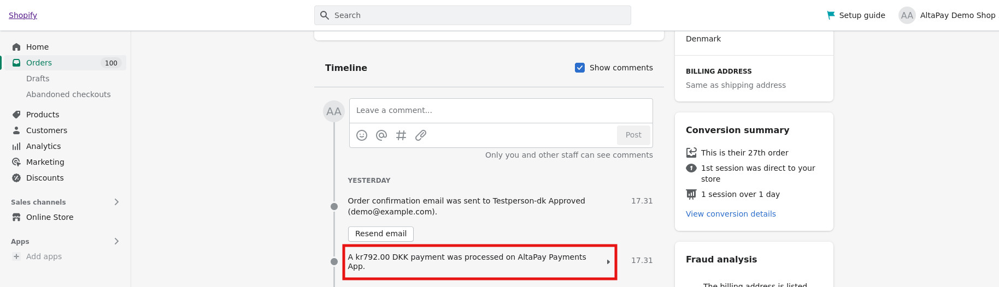
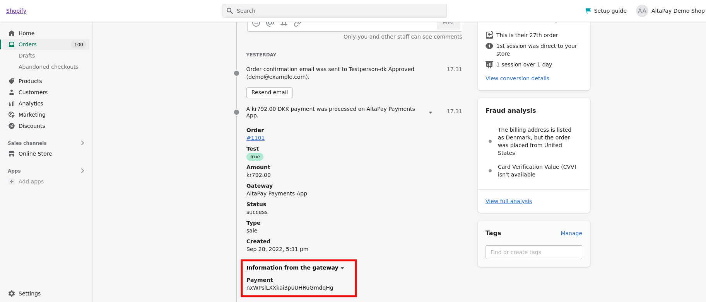

# AltaPay Payments Apps

You can use the AltaPay Payments Apps to configure the gateway, and access various gateway features directly in Shopify.

Installing and configuring is very straightforward. You simply take the following steps:

1. Install the app
2. Configure the app
3. Configure your payment methods
4. Style your payment forms

We will take you through each of the steps in detail in the following sections, after which you will be ready to use your app.

**Versions**

New versions of the app will be released as new features are added and bugs are fixed.

## Installation

Installing these apps will enable the web shop to handle payments through AltaPay's gateway.

**Table of Contents**

 - [Prerequisites](#prerequisites)

 - [App Types](#app-types)
  
    * [Multiple Payment Options App](#multiple-payment-options-app)
    * [Individual Payment option App](#individual-payment-option-app)

 - [Installation Links](#installation-links)
  
    * [App with Multiple Payment Options](#app-with-multiple-payment-options)
    * [Individual app for Card Payments](#individual-app-for-card-payments)
    * [Individual app for MobilePay](#individual-app-for-mobilepay)
    * [Individual app for Vipps](#individual-app-for-vipps)
    * [Individual app for Klarna](#individual-app-for-klarna)
    * [Individual app for iDEAL](#individual-app-for-ideal)
    * [Individual app for ViaBill](#individual-app-for-viabill)
    * [Individual app for Swish](#individual-app-for-swish)
    * [Individual app for Bancontact](#individual-app-for-bancontact)
    * [Individual app for Bank Payments](#individual-app-for-bank-payments)
    * [Individual app for Payconiq](#individual-app-for-payconiq)

 - [Configuration](#configuration) 
  
    * [Configuring the checkout options](#configuring-the-checkout-options)
      
    * [Configuring the AltaPay Payments App](#configuring-the-altapay-payments-app)

    * [Configuring the Payment Methods](#configuring-the-payment-methods)

 - [Styling](#styling)

    * [Styling the Payment Pages in the AltaPay Payments App for Shopify](#styling-the-payment-pages-in-the-altapay-payments-app-for-shopify)

    * [Enable Credit Card Form by Default on Checkout](#enable-credit-card-form-by-default-on-checkout) 

    * [Checkout form styling](#checkout-form-styling)

    * [Customize checkout page](#customize-checkout-page) 

 - [Using the AltaPay Payments App for Shopify](#using-the-altapay-payments-app-for-shopify)

 - [Viewing Payment Details](#viewing-payment-details)

 - [Switching between production and test environments](#environments)

 - [Making a test order](#making-a-test-order)
  
 - [Reconcile Orders](#reconcile-orders)

## Prerequisites

Before configuring the app, you need the below information. These can
be provided by AltaPay.

1.  AltaPay credentials:

    * Username
    * Password

2.  AltaPay gateway information:

    * Terminal
    * Gateway

> **Note**
>
> For the successful installation and configuration:
> * Make sure that the browser cookies are enabled.
> * If you are using an Ad Blocker, try to disable it before app installation and configuration.

## App Types

AltaPay offers two types of apps for Shopify payments. The first one shows a single payment option with the title "AltaPay - Multiple Payment Options" on the Shopify checkout page and the customer will see all the available options on the next page.

The second one is a separate app for each payment method individually shown on the Shopify checkout page. 
Once a customer selects that, he will be redirected to the respective payment method. This also reduces one step as compared to the above app type and increases the conversion rate as well.

Below are sections that include the sample screenshots of each app type.

  * ### Multiple Payment Options App

    

    

  * ### Individual Payment option App

    

## Installation Links

You can install the apps directly using the below respective installation links:

* ### App with Multiple Payment Options

  ```
  https://accounts.shopify.com/store-login?redirect=settings%2Fpayments%2Falternative-providers%2F1059191
  ```

* ### Individual app for Card Payments

  ```
  https://accounts.shopify.com/store-login?redirect=settings%2Fpayments%2Falternative-providers%2F25133057
  ```

* ### Individual app for MobilePay

  ```
  https://accounts.shopify.com/store-login?redirect=settings%2Fpayments%2Falternative-providers%2F20381697
  ```

* ### Individual app for Vipps

  ```
  https://accounts.shopify.com/store-login?redirect=settings%2Fpayments%2Falternative-providers%2F25657345
  ```

* ### Individual app for Klarna

  ```
  https://accounts.shopify.com/store-login?redirect=settings%2Fpayments%2Falternative-providers%2F20807681
  ```

* ### Individual app for iDEAL

  ```
  https://accounts.shopify.com/store-login?redirect=%2Fadmin%2Fsettings%2Fpayments%2Falternative-providers%2F29229057
  ```

* ### Individual app for ViaBill

  ```
  https://accounts.shopify.com/store-login?redirect=%2Fadmin%2Fsettings%2Fpayments%2Falternative-providers%2F30998529
  ```

* ### Individual app for Swish

  ```
  https://accounts.shopify.com/store-login?redirect=%2Fadmin%2Fsettings%2Fpayments%2Falternative-providers%2F28016641
  ```

* ### Individual app for Bancontact

  ```
  https://accounts.shopify.com/store-login?redirect=%2Fadmin%2Fsettings%2Fpayments%2Falternative-providers%2F41353217
  ```

* ### Individual app for Bank Payments

  ```
  https://accounts.shopify.com/store-login?redirect=%2Fadmin%2Fsettings%2Fpayments%2Falternative-providers%2F45875201
  ```

* ### Individual app for Payconiq

  ```
  https://accounts.shopify.com/store-login?redirect=%2Fadmin%2Fsettings%2Fpayments%2Falternative-providers%2F51838977
  ```

## Configuration

### Configuring the checkout options

When you first open the app from the admin page in Shopify, you need to configure the checkout options.

1. Navigate to the **Admin** page, using the URL.
2. Select the **Settings** button in the bottom left of the screen.

    

3. Go to **Payments**

4. Scroll down to **Supported payment methods** and do one of the following:
- If you see AltaPay, click on the **Manage** button beside it. 

    

- If AltaPay is not displayed, select the **Add payment methods** button, and select AltaPay from the list
5. Select the payment icons that you want to display with AltaPay payment method on checkout page.

    

    **Note:** Maximum of 4 icons will be displayed or ‘and more’ will be displayed in the checkout.

    

8. You may choose to enable test mode by selecting the checkbox at the bottom of the screen.
**If test mode is enabled, all transactions, including those made using the Production tab, will go to the test gateway. No actual financial transactions will take place.**

    If linking the account to testgateway.altapaysecure.com, then ‘TEST MODE’ must be enabled to avoid error in checkout! 

    

9. Click **Activate** when you have completed the details.
10. Next, you need to configure the app. See [Configuring the AltaPay Payments App](#configuring-the-altapay-omni-app) for more details.

### Configuring the AltaPay Payments App

Having configured the AltaPay payments, you now need to configure the app.

> **Prerequisites**
> 
> To log in, you will need:
> - The username and password for your AltaPay Omni-Channel account
> - The URL for the AltaPay Omni-Channel gateway
> 
> All of these will be provided by AltaPay.

1. Navigate to the **Admin** page, using the URL.
2. Select **Settings** and then **Payments**.
3. Scroll down to **Supported payment methods** and click **Manage** link besides AltaPay payment method.
4. Click on **Manage** button from **Account status** section.
5. This will redirect you to **AltaPay Payments App** configuration page.
6. You will see that there are two tabs on this page, even if you do not have a production account:
- **Test** for configuring a test account which can be used to test the gateway. No actual financial transactions will be made via this account.
- **Production** for configuring the production account, i.e. the account which will enable actual financial transactions. **If test mode is enabled in the AltaPay Omni gateway, all transactions, including those done in the Production tab, will go to the test gateway and no actual transactions will take place.**

5. Make sure that you are working in the correct tab.
6. Enter the username and password AltaPay has given to you.
7. If you are working in the Production account, specify the AltaPay Omni-Channel URL.

    

8. Save the details.
9. Next, you need to configure the payment methods (terminals). See [Configuring the Payment Methods](#configuring-the-payment-methods) for more details.

### Configuring the Payment Methods

> **Prerequisites**
> 
> To log in, you will need:
> 
> - The username and password for your AltaPay Omni-Channel account. These are provided by AltaPay.
> - The URL for your Shopify shop's admin page.

1. Navigate to the app page.
2. You will see that there are two tabs on this page:

    >- **Test** for configuring a test account which can be used to test the gateway. No actual financial transactions will be made via this account.
    >- **Production** for configuring the production account, i.e. the account which will enable actual financial transactions. **If test mode is enabled in the AltaPay Omni gateway, all transactions, including those done in the Production tab, will go to the test gateway and no actual transactions will take place.**

    <br>

3. Make sure that you are working in the correct tab.
4. You will see a list of payment methods configured by AltaPay according to the agreement you have made with us. 

    > **Note**
    > 
    > * If you are configuring the payment method for individual app, you will see detail page instead of payment methods list. 
    > * Skip point 5 and 6 for individual app.

    <br>
  
    

    The default names of the payment methods come from the title the payment method has been given by AltaPay.

5. Click on a given terminal/payment method to change the configuration.
6. The payment method details are displayed. Configure the details as required, using the notes and illustration for guidance.

    

7. Configuration payment method for individual apps.

    > **Note**
    > 
    > Skip this point if you are configuring the app with Multiple Payment Options 

    

>- Complete the details:

<table>
<tbody>
  <tr>
    <td><strong>Payment method name as displayed to customer</strong></td>
    <td>Key in the name you want show on the screen</td>
  </tr>
  <tr>
    <td><strong>Secret</strong></td>
    <td>The payment method <strong>secret</strong>. If it is decided as part of the onboarding process that this parameter is relevant for you, it will be provided by AltaPay.</td>
  </tr>
  <tr>
    <td><strong>Display priority</strong></td>
    <td>Enter a value to indicate the order in which you want payment methods to be displayed on the page, where the customer selects their preferred payment method. 1 is the highest priority. If you give the same display priority to more than one payment methods, they will be shown in alphabetical order.
</td>
  </tr>
</table>
</tbody>

- Specify whether **order lines** will be shown in the payment form.

>**Note**
>
> Order lines are required for Klarna payments. So you have to enable the "Order lines" option for Klarna in Terminal settings. This will automatically add a single line item with **Total** amount as Shopify does not share actual line items with any third-party payment provider.
>
> To enable the order lines, click on a Klarna terminal and scroll to the "Order lines" section, and click on the "Enable" button.

- Select whether the **payment method is active** - this decides whether the customer can select this payment method to complete the transaction.
- Choose from the predefined **icons** to display to the customer for a given payment method. You can select a single icon from the left hand column. If the payment method is **Credit Card**, you can select multiple icons. These will be shown in the **Select Payment Method** page, and the **Payment Form** page.

7. Click on <strong>Save </strong>to save the details.

**Requirements for Specific Payment Methods**

## Styling 

### Styling the Payment Pages in the AltaPay Payments App for Shopify

You can style the **Select Payment Method** and **Payment Form** pages within the **Shopify plugin**.

> **Prerequisites**
> 
> To log in, you will need:
> 
> - The username and password for your AltaPay Omni-Channel account
> - The URL for your Shopify shop's admin page.
(It is typically in the format <strong>https://<shop_name>.myshopify.com/admin)</strong>
> 
> All of these details will be emailed to you by AltaPay as part of the onboarding.

1. Navigate to the **Admin** page, using the URL.
2. Select **Settings** and then **Payments**.
3. Scroll down to **Supported payment methods** and click **Manage** link besides AltaPay payment method.
4. Click on **Manage** button from **Account status** section.
5. This will redirect you to **AltaPay Payments App** configuration page.
6. Select **Settings** at the top of the window.
7. Scroll down to the **Payment pages styling** section, where you will find the code for the <b>Select Payment Method</b> page, followed by the <b>Payment Form page</b>.
8. Make your changes, noting the following:

    >- In the Select <b>Payment Method</b> page:
    >- The mandatory payment method placeholder is

    <br>

    ```html
        <div class="sm:w-1/2 sm:mr-2 md:mr-4 order-2 sm:order-1" id="PaymentMethodsPlaceholder"></div>
    ```
    >- The order details placeholder is<br>
    ```html
        <div class="sm:w-1/2 sm:ml-2 md:ml-4 sm:mb-0 order-1 sm:order-2" id="OrderDetailsPlaceholder">
    ```
In the <b>Payment Form</b> page:

- The credit cards placeholder is<br>
  ```html
      <div class="px-4 md:px-10 text-center mb-8" id="CreditCardsPlaceholder">
  ```
- The dynamic cancel payment url will be replaced on a <a> tag with CancelPaymentLinkPlaceholder
- The cancel payment button <b>(CancelPaymentButtonPlaceholder)</b> will be removed for credit customer and verify card transactions
  <br>

  >You should adhere to the rules and advice specified in the online help in the testgateway - https://testgateway.altapaysecure.com/merchant/help/FrontendIntegration#Payment_page__form_callback

8. Click on <b>Save</b> to save the details, or <b>Reset HTML to Default</b> to restore the default settings.

### Enable Credit Card Form by Default on Checkout

  >**Note**
  >
  > This is only applicable if you are configuring the AltaPay app with Multiple Payment Options.
  > Skip this section for individual app types.

  **Display the credit card inputs by default on the terminal selection page**

  
      
To display the credit card inputs by default on the terminal selection page follow the below steps.
Login to the Shopify admin section.
  
-  Navigate to the **Admin** page, using the URL.
-  Select **Settings** and then **Payments**.
-  Scroll down to **Supported payment methods** and click **Manage** link besides AltaPay payment method.
-  Click on **Manage** button from **Account status** section.
-  This will redirect you to **AltaPay Payments App** configuration page.
- Click on the **Settings** tab.
- Scroll to **Show credit card form by default** section and click on **Activate** button and **Save** the
settings.

### Checkout form styling
  
You can change the `Checkout form style` by following the below mentioned steps.

Login to the Shopify admin section.

- Navigate to the **Admin** page, using the URL.
- Select **Settings** and then **Payments**.
- Scroll down to **Supported payment methods** and click **Manage** link besides AltaPay payment method.
- Click on **Manage** button from **Account status** section.
- This will redirect you to **AltaPay Payments App** configuration page.
- Click on the **Settings** tab.
- Scroll to **Checkout Page Settings** section.
- Choose `Checkout form style` option from the dropdown and **Save** the
settings.

  

- Frontend view with `Checkout` style

  

- Frontend view with `Legacy` style

  

  >**Note**
  > This notice is intended exclusively for current merchants. If you are configuring the app for the first time, please ignore this section.
  >
  > - Do not include any classes or attributes within the `<body>` tag.
  > - If you have added any classes to the `<body>` tag, the `checkout` design option may not render correctly. Remove any classes or attributes from the `<body>` tag and save the settings.
  > - Be sure to reset the HTML to default by clicking `Reset HTML to default` button.

### Customize checkout page

While checkout customizations are typically outside the scope of payments apps, there may be situations where customizing the checkout page can enhance the overall customer checkout experience or meet specific regional requirements.

If you want to customize your shop checkout page, you can explore the various apps available on the Shopify app store for checout customizations at the below link.

https://apps.shopify.com/collections/customize-checkout-with-apps

## Using the AltaPay Payments App for Shopify

### Viewing Payment Details

You can view details on payments in the Shopify app, including payment method, fraud information, payment options, and, if relevant, gift card details.

1. Navigate to the **Admin** page, using the URL.
2. Select **Orders** in the left hand pane.
3. Select the order you want to view.
4. In the **Timeline** section, click on the AltaPay's payment link.
5. Click on **Information from the gateway** to see the gateway Order ID.
6. Copy the payment ID (remove any dashes and underscores in it) and search the order on the gateway side.

## Environments

**Switching between production and test environments**

If you want to test the gateway in the test environment and switch to the production environment, or vice versa, you must remember to:

-	Change the account details on the gateway, and set the test flag accordingly:
    >1.	Go to Settings > Payments.
    >2. Scroll down to **Supported payment methods**.
    >3. Click **Manage** where it says “AltaPay”.
    
    <br>

    

    > **Tips**
    > 
    > Ensure the relevant account is defined in the app, as described in [Configuring the AltaPay Payments App](#configuring-the-altapay-payments-app).

## Making a test order

In order to place an order and pay with the AltaPay Omni-Channel test gateway, you should first ensure the test environment is properly set up:

- Change the account details on the gateway, and set the test flag accordingly:
    <br>

  >1. Go to Settings > Payment providers.
  >2. Scroll down to **Supported payment methods**.
  >3. Click **Manage** where it says “AltaPay”.

    <br>

  

  > **Tips**
  > 
  > Ensure the relevant account is defined in the app, as described in  [Configuring the AltaPay Payments App](#configuring-the-altapay-payments-app).

1. Place an order by selecting the **AltaPay - Multiple Payment Options** in the checkout.
2. Select the payment method on the following page and enter some dummy payment details.
3. You know that it has completed successfully when the Success page is displayed.

  > **Notes**
  > 
  > The payment can be released, captured and/or refunded as well.


## Reconcile Orders
In order to reconcile payments on AltaPay please follow the steps below:

1. Navigate to the **Admin** page, using the URL.
2. Select **Orders** in the left hand pane.
3. Select the order you want to view.
4. In the **Timeline** section, Click the dropdown to view the AltaPay Payments App payment details.
 
   
 
5. Click on **Information from the gateway** to see the gateway payment id.
6. Copy the payment id, as it is the reconciliation identifier on AltaPay.
 
   

7. Or export the order data from Shopify by selecting the order(s) you want to export and click **Export** button in the top right corner.

     
 
8. Navigate to AltaPay Gateway dashboard
9. Click on **FUNDING FILES** under **FINANCES** menu
10. Download the CSV file
11. Or you can find the payment in the transaction list, open the reconciliation file from there and download a csv file
12. Open the downloaded CSV file and match the **Reconciliation Identifier** with the **Payment ID** (on the Shopify order timeline) to map the payments.

 Below are the screenshots from the AltaPay Gateway CSV file & Shopify exported order data respectively.   

**Sample AltaPay Gateway CSV:**


**Shopify exported order CSV:**

 

 